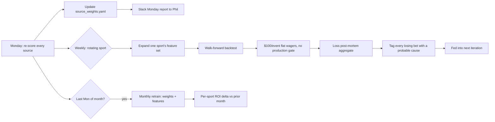

# Flashcat Agent Loop

> Phil — 2026-05-31: "I am just providing you examples of how to think about
> problem solve so that you can work on the model and be constantly learning
> and backtesting."

The predict.tennis ask was an EXAMPLE OF METHOD, not a one-off task. The repo
now operates as a continuous learning loop. This document is the standing
operational cadence — what runs when, what it produces, and what's reported
back to Phil.

## Why this exists

The v1 model shipped flat-$100-on-every-event and lost to vig. v2 added a
Kelly gate and an edge threshold — but the only way we keep beating those
gates is by **continuously re-evaluating every source as new data lands**.
A source that was profitable in 2023 is allowed to become noise in 2026.
The loop is the mechanism for catching that.

## Loop overview



## Weekly — every Monday

### 1. Re-score every source on every sport

Runs `scripts/weekly_source_rescore.sh`. Generates a fresh
`paw-reports/sportsbetting/source-accountability-YYYY-MM-DD.md` and
overwrites `source-accountability-latest.md`. Calls
`python -m flashcat source-accountability` under the hood.

Outputs per (sport × source):
- n_predictions, hit rate, Brier, log loss
- ROI on $100-per-event flat wagers (no edge gate, no Kelly — the
  intentionally meaner source audit)
- CLV (closing-line value vs picked-side market implied)
- Max drawdown, longest losing streak
- Verdict bucket: KEEP / KEEP-WITH-CAVEATS / NOISE / DROP / INSUFFICIENT-DATA

Sources that flip from KEEP to NOISE get demoted in next week's
`source_weights.yaml`. Sources that flip to DROP get excluded.

### 2. Update `source_weights.yaml`

Existing pipeline: `python -m flashcat reweight` uses the
brier_roi_hybrid softmax to recompute per-sport weights. Inputs are the
freshly re-scored metrics from step 1. Re-runs of the live build pull these
weights via `flashcat.model.blend.load_weights`.

### 3. Rotating-sport feature expansion

Each week, ONE sport gets feature-engineering attention. Rotation (2026-Q3):
- Week 1: NFL — bring back QB/EPA splits, weather adjustment
- Week 2: ATP — surface-specific Elo, Sackmann grass/clay/hard separation
- Week 3: WTA — same
- Week 4: MLB — Statcast park-adjusted run expectancy
- Week 5: NBA — rotation lineup + pace adjustments

The expanded feature set runs through a walk-forward backtest with the
production gate **bypassed** ($100/event flat wagers across every qualifying
historical event), so we can isolate the feature contribution from the
gate's filtering effect.

### 4. Loss post-mortem aggregate

Every losing $100/event bet from the rotating sport's backtest gets tagged
with a probable-cause bucket:
- `injury-or-late-scratch` — public injury news between line move and event
- `weather` — rain/wind/temperature outside normalized range
- `lineup-surprise` — MLB-specific (Statcast lineup mismatch from projected)
- `coaching-decision` — late line move on coaching/rotation news
- `market-overcorrected` — sharp money already moved the line past fair
- `model-noise` — no identifiable cause; chalked up to variance
- `model-blind-spot` — recurring loss pattern the model doesn't capture

Aggregate cause distribution feeds into next week's feature expansion
decisions. If `market-overcorrected` dominates, the edge gate needs to
widen; if `model-blind-spot` dominates, the feature set is missing a
signal.

### 5. Monday Slack report to Phil

DM thread: `D0B4NLPQPAL`. Format:

```
*Flashcat weekly — YYYY-MM-DD*

PER-SPORT ROI Δ vs prior week:
  nfl: +X.XX% → +Y.YY%  (Δ +Z.ZZpp, n_bets +N)
  atp: ...

PER-SOURCE CLV Δ:
  nfl-nflfastr-epa: +X.X pp → +Y.Y pp (Δ +Z.Z)
  ...

DROPPED this week: [list]
ADDED this week:   [list]

LOSS POST-MORTEM TOP CAUSES (rotating sport = <sport>):
  1. <cause>: NN bets, -$XXX
  2. ...

VERDICT ROLL-UP: KEEP=X, KEEP-WITH-CAVEATS=Y, NOISE=Z, DROP=W

Honesty: <any negative ROI numbers, dropped sources, blown calibration
slopes — called out explicitly. No spin.>

Report: paw-reports/sportsbetting/source-accountability-YYYY-MM-DD.md
```

## Monthly — last Monday of the month

### Retrain

- Re-run full multi-sport backtest with the new feature set across all
  five rotated sports
- Re-fit Platt calibration on the blender output
- Update `source_weights.yaml` AND `calibration.json`
- Compute per-sport blended ROI delta vs prior month

Posted to Slack as a follow-up to the Monday report with the same honesty
rule: if blended ROI dropped, say so and propose the next experiment.

## Honesty rule

> A source losing money on $100/event hypothetical wagers gets called
> **noise**, not spun. A losing month gets called a losing month. We do not
> cherry-pick windows, exclude unfavorable sports from headline numbers, or
> rebase to ROI > 0 on the +3pp Kelly gate to make the audit look better.
>
> The +3pp Kelly gate IS the production rule and IS the right framing for
> the live-money question "should I bet this?" — but the source audit is
> intentionally meaner because that's the only way we catch a source
> degrading before the Kelly gate stops covering for it.

## What's NOT in the loop

- Live picks on the public site — handled by the daily refresh cron
  (`.github/workflows/daily-refresh.yml`), not this loop
- Bankroll management for real money — out of scope (research only)
- Sport-specific deep models like xG / EPA refits — those live in the
  per-sport source connectors; the loop just measures their output

## Files the loop touches

- `data/source_history.db` — read; never mutated outside of backfill scripts
- `data/source_weights.json` — rewritten by `flashcat reweight`
- `data/calibration.json` — rewritten by `flashcat calibrate`
- `data/source_scoreboard.json` — rewritten by `flashcat backtest`
- `paw-reports/sportsbetting/source-accountability-*.md` — written by the
  weekly rescore (dated + `-latest`)
- `paw-reports/sportsbetting/source-accountability-*.json` — same, machine-
  readable companion

## First run

This document was created alongside the first source-accountability run on
2026-05-31. See `paw-reports/sportsbetting/source-accountability-latest.md`
for what the first report looks like.
